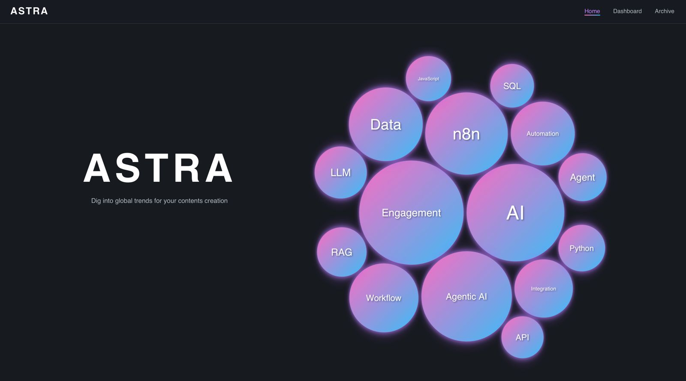

# Interactive Trend Dashboard

It is an example of modern, interactive dashboard web app that visualizes social media trends and content strategies at a glance.  
It provides data-driven insights by visually analyzing real-time trending keywords.

---

## ✨ Features

- **Real-time Trend Bubble Chart**  
  - Visualizes the top 15 trending keywords from the latest `trend.csv` file, with size, color, and neon effects based on rank
  - 5 distinct bubble sizes by rank, smooth animations, and hover interactions
- **Modern Design**  
  - Inter font, gradient colors, neon effects, and dark theme
- **Automatic Data Updates**  
  - When `trend.csv` is updated (e.g., via GitHub Actions), the dashboard reflects the latest trends on refresh

---

## 🛠️ Tech Stack

- React 18
- d3.js (pack layout)
- styled-components
- PapaParse (CSV parsing)
- SVG, CSS3

---

## 📊 Data Structure

- `public/trend.csv`  
  - Example:
    ```
    keyword,score
    AI,120
    Shorts,90
    Vlog,60
    ...
    ```
  - Only the top 15 by score (descending) are visualized

---

## 🧑‍💻 Customization

- Simply replace the `trend.csv` file to update trends automatically
- Bubble size, color, neon effects, etc. can be adjusted in `src/components/PackedBubbleChart.jsx`

---

## 🙏 Special Thanks

- d3.js, styled-components, papaparse, and the open source community

---

## 🖼️ Preview


